# Enterprise Agent–Tool Coordination: The Complete Guide

## How Agents and Tools Connect, Communicate, and Stay Safe — From First Principles to Production

> **Scope:** Multi-Agent Systems (MAS) in production — CrewAI, AutoGen, LangGraph, custom runtimes  
> **Audience:** GenAI Engineers · MAS Architects · Backend Engineers building agentic workflows  
> **Edition:** 2025–2026  
> **Reading time:** 40 minutes (core) + 20 minutes (project-specific depth)

---

## Table of Contents

1. [Why This Problem Matters](#1-why-this-problem-matters)
2. [Fundamental Vocabulary](#2-fundamental-vocabulary)
3. [The Agent–Tool Contract](#3-the-agenttool-contract)
4. [How the Connection Works: Tool → Agent](#4-how-the-connection-works-tool--agent)
5. [How the LLM Sends Information to a Tool](#5-how-the-llm-sends-information-to-a-tool)
6. [The Authorization Layer: Who Decides What](#6-the-authorization-layer-who-decides-what)
7. [Enterprise Reliability Patterns](#7-enterprise-reliability-patterns)
8. [Project Architecture: How Resume Tailor Wires Tools](#8-project-architecture-how-resume-tailor-wires-tools)
9. [Anti-Patterns Reference](#9-anti-patterns-reference)
10. [Quick Reference Card](#10-quick-reference-card)

---

## 1. Why This Problem Matters

```
THE COST OF GETTING IT WRONG

┌───────────────────────────────────────────────────────────────────────┐
│                                                                       │
│  A single agent with access to 19 micro-tools costs ~2,000+ tokens    │
│  per LLM call in tool descriptions alone — before a single tool       │
│  is actually invoked. If your pipeline has 8 agents and each carries  │
│  every tool, that's 16,000 tokens of tool schema overhead per run.    │
│                                                                       │
│  In production, the REAL cost is reliability:                         │
│                                                                       │
│  ❌ Agent hallucinates and calls the wrong tool                       │
│  ❌ Agent calls a tool it shouldn't have access to                    │
│  ❌ Tool crashes and takes down the entire agent pipeline             │
│  ❌ Handoff loops: Agent A → Agent B → Agent A → ...                  │
│  ❌ Context bloat: tool output from turn 3 persists through turn 40   │
│                                                                       │
└───────────────────────────────────────────────────────────────────────┘
```

The instinctive response to tool coordination is "just pass the right function references." This assumption is wrong in almost every material case affecting production reliability. The connection between an agent and its tools is not a simple function call — it's a **four-layer protocol** spanning prompt engineering, LLM function-calling, runtime interception, and authorization guardrails. Every layer can fail independently.

This document explains the complete mechanism, grounded in how multi-agent runtimes work at the API level, and maps every concept onto the **Resume Tailor** production codebase so you can see both theory and practice in one place.

**Three questions drive this entire guide:**

| # | Question | Short Answer |
|---|---|---|
| 1 | How does the tool-to-agent connection work? | The tool's name, description, and parameter schema are injected into the agent's LLM prompt. The agent runtime intercepts function calls, executes the Python function, and feeds the result back. |
| 2 | How does the LLM send information to the tool? | The LLM emits a structured `FUNCTION_CALL` with arguments it constructs from context. The runtime parses, validates, and dispatches it. |
| 3 | Who decides which agent gets which tool? | Three layers: **static assignment** (the `tools=[...]` list at agent creation), **system prompt guardrails** (the LLM reads when to use a tool), and **runtime interceptors** (the circuit breaker). |

---

## 2. Fundamental Vocabulary

Before any mechanism makes sense, you need precise definitions of the nouns.

```
┌─────────────────────────────────────────────────────────────────────────────┐
│                         THE FOUR ACTORS                                     │
│                                                                             │
│  AGENT       An LLM instance with a specific role, its own system prompt,   │
│              its own tools, and its own decision-making scope.              │
│              Example: "Job Analyzer Agent" — only parses job descriptions.  │
│                                                                             │
│  TOOL        A function the LLM can call to interact with the outside world.│
│              Has a name, a description (WHEN to use it), and a parameter    │
│              schema (WHAT arguments it needs).                              │
│              Example: `match_job_requirements(resume_json, job_json)`       │
│                                                                             │
│  ENGINE      A pure, single-purpose computation unit. Takes typed data,     │
│              returns a typed result. Never calls the LLM directly.          │
│              Example: `audit_bullet_structure(resume) → ReviewResult`       │
│                                                                             │
│  RUNTIME     The framework machinery that intercepts LLM function calls,    │
│              executes actual Python functions, manages conversation history,│
│              and handles retries. CrewAI is the runtime in this project.    │
│                                                                             │
└─────────────────────────────────────────────────────────────────────────────┘
```

**Critical distinction — Tool vs. Engine:**

In enterprise systems, you do **not** hand raw computation functions to an LLM. The LLM sees a **coarse tool** (a bundled, rendered interface). Behind that tool, **fine-grained engines** do the actual work. This separation exists for three reasons:

1. **Cognitive load.** An agent choosing between 4 tools makes better decisions than an agent choosing between 19.
2. **Testability.** Engines are pure functions — you can unit-test them without an LLM.
3. **Serialization boundary.** Engines work with typed data (`Resume` object). Tools work with strings (what the LLM sends/receives). The tool is the translation layer.

```
   AGENT (LLM)                     TOOL (Layer 2)                    ENGINES (Layer 1)
   "audit this resume" ──► parse JSON → typed object ──────► engine A → ReviewResult
                          run engines                      ► engine B → ReviewResult
                          merge + render ◄─────────────────► engine C → ReviewResult
   readable report ◄────── return string
```

This is not a CrewAI-specific pattern. Every production MAS (AutoGen, LangGraph, custom) that has survived past the prototype phase converges on this two-layer design.

---

## 3. The Agent–Tool Contract

### 3.1 What an Agent IS (The Definition)

In every MAS framework, an agent is exactly four binding decisions made at creation time:

```python
class AgentDefinition:
    name: str              # Unique identity: "JobAnalyzerAgent"
    model: str             # Which LLM: "gemini/gemini-2.5-flash"
    system_prompt: str     # Persona + constraints + output format
    tools: List[Tool]      # What actions it can take — THIS IS THE CONNECTION

    # Enterprise reliability hooks (often skipped, always regretted):
    on_start: Callable     # Called when agent initializes
    on_receive: Callable   # Called when message arrives
    on_error: Callable     # Called when something fails
    on_complete: Callable  # Called when task completes
```

**These four bindings are immutable for the lifetime of the agent.** An agent created without `tools=[audit_truthfulness]` can never call `audit_truthfulness`, no matter what the LLM hallucinates. This is the first and strongest authorization layer.

### 3.2 What a Tool IS (The Interface the LLM Sees)

A tool, from the LLM's perspective, is **not** a Python function. It is a schema — a JSON object that describes a callable capability:

```json
// What the LLM actually receives in its prompt:

{
  "type": "function",
  "function": {
    "name": "match_job_requirements",
    "description": "Classify how well the resume evidences each job requirement,
                    plus keyword coverage. Use when you need to compare a resume
                    against a job description for gaps and alignment.",
    "parameters": {
      "type": "object",
      "properties": {
        "resume_json": {
          "type": "string",
          "description": "A Resume serialized as JSON."
        },
        "job_json": {
          "type": "string",
          "description": "A JobDescription serialized as JSON."
        }
      },
      "required": ["resume_json", "job_json"]
    }
  }
}
```

This schema is auto-generated by CrewAI from the `@tool` decorator — specifically from the function's **docstring** and **type hints**. The docstring is not documentation for developers; it is the **instruction manual for the LLM** on when and how to use the tool.

**Three things the LLM learns from this schema:**
1. **What the tool does** (from `description`) — the LLM decides whether it needs this tool based on this text.
2. **What arguments to pass** (from `parameters`) — the LLM constructs arguments by reading its conversation context.
3. **What it will get back** (from `description`) — the expected result format guides the LLM's next action.

### 3.3 The Contract in One Diagram

```
┌──────────────────────────────────────────────────────────────────────────────┐
│                        THE TOOL CALL LIFECYCLE                               │
│                                                                              │
│  PHASE 1: PROMPT ASSEMBLY (the connection is established)                    │
│  ┌─────────────────────────────────────────┐                                 │
│  │ System Prompt: role + goal + backstory  │                                 │
│  │ Task Description: what to do            │                                 │
│  │ Tool Schemas: [tool1, tool2, ...]       │ ← THE CONNECTION (Q1)           │
│  └────────────────────┬────────────────────┘                                 │
│                       │ sent to LLM                                          │
│                       ▼                                                      │
│  PHASE 2: LLM REASONING                                                      │
│  ┌─────────────────────────────────────────┐                                 │
│  │ LLM reads task, checks tool schemas,    │                                 │
│  │ decides: "I need to call tool X"        │                                 │
│  │ Constructs arguments from context       │ ← THE SENDING (Q2)              │
│  │ Outputs: FUNCTION_CALL(name, args)      │                                 │
│  └────────────────────┬────────────────────┘                                 │
│                       │ intercepted by runtime                               │
│                       ▼                                                      │
│  PHASE 3: TOOL EXECUTION                                                     │
│  ┌─────────────────────────────────────────┐                                 │
│  │ Runtime validates args against schema   │                                 │
│  │ Calls Python function with args         │ ← THE AUTHORIZATION (Q3)        │
│  │ Captures return value                   │                                 │
│  └────────────────────┬────────────────────┘                                 │
│                       │                                                      │
│                       ▼                                                      │
│  PHASE 4: RESULT FEEDBACK                                                    │
│  ┌─────────────────────────────────────────┐                                 │
│  │ Result appended to conversation as      │                                 │
│  │ [tool] message                          │                                 │
│  │ LLM reads result, continues reasoning   │                                 │
│  └─────────────────────────────────────────┘                                 │
│                                                                              │
└──────────────────────────────────────────────────────────────────────────────┘
```

---

## 4. How the Connection Works: Tool → Agent

### 4.1 The Bottom-Up Fallacy

You asked: *"From a bottom-up approach, is it now tools that need to be connected to each agent?"*

**The mental model is wrong, and the wrong mental model will produce fragile code.**

```
❌ WRONG MENTAL MODEL (bottom-up):
   "The tool reaches out and attaches itself to an agent."

   Tool ──connects to──► Agent
         (active)          (passive)

✅ CORRECT MENTAL MODEL (top-down):
   "The agent is created with a specific toolset. The tool has no
    knowledge of which agent is using it — or even IF it's being used."

   Agent(tools=[tool1, tool2])  ← The agent owns the list.
         (active)      (passive)   The tool is just a function reference.
```

**Why this distinction matters in production:** If you think tools connect to agents, you will build a registry system where tools look up agents. That creates a circular dependency, makes testing impossible (you can't test a tool without standing up an agent), and breaks the fundamental MAS principle that agents are autonomous decision-makers and tools are passive capabilities.

The correct architecture: **tools are created independently, stored in a module, and imported by agent factories.** The tool module has zero imports from the agent module.

### 4.2 How the Binding Happens (Framework-Level)

In CrewAI, the binding is a single line of Python:

```python
from crewai import Agent
from src.tools.agent_facing_tools import match_job_requirements, audit_truthfulness

agent = Agent(
    role="Gap Analysis Specialist",
    goal="Compare resume against job and identify gaps",
    backstory="You are an expert at matching qualifications to requirements...",
    tools=[match_job_requirements],  # ← THE BINDING
)
```

What happens inside CrewAI when this Agent is created:

```
Agent(tools=[match_job_requirements])
    │
    ├── CrewAI introspects the @tool-decorated function:
    │   - function name → tool name ("Match Job Requirements")
    │   - function docstring → tool description
    │   - function type hints → parameter schema
    │   - function signature → required vs optional params
    │
    ├── CrewAI stores the schema for prompt injection later:
    │   agent.tools = [
    │     CrewAITool(
    │       name="Match Job Requirements",
    │       description="Classify how well the resume evidences...",
    │       func=match_job_requirements,  # the actual callable
    │       args_schema={"resume_json": str, "job_json": str}
    │     )
    │   ]
    │
    └── At kickoff() time, CrewAI serializes ALL tools into
        the LLM provider's function-calling format and appends
        them to the system prompt.
```

**The tool never accesses `self.agent` or any agent reference.** It receives arguments and returns a string. This is not a design preference — it is the contract that makes tools independently testable.

### 4.3 What Happens When `crew.kickoff()` Runs

This is the precise sequence that connects tools to the LLM at execution time:

```
crew.kickoff()
    │
    ├─ 1. CrewAI loads the task description
    │
    ├─ 2. CrewAI constructs the system prompt:
    │      f"You are {agent.role}. Your goal: {agent.goal}. {agent.backstory}"
    │
    ├─ 3. CrewAI serializes agent.tools → provider-native tool definitions
    │      OpenAI:  {"type": "function", "function": {...}}
    │      Anthropic: {"name": "...", "description": "...", "input_schema": {...}}
    │      Google:   {"functionDeclarations": [{...}]}
    │
    ├─ 4. CrewAI sends to LLM provider:
    │      POST /v1/chat/completions
    │      {
    │        "model": "gemini-2.5-flash",
    │        "messages": [
    │          {"role": "system", "content": "<system prompt>"},
    │          {"role": "user", "content": "<task description>"}
    │        ],
    │        "tools": [<serialized tool schemas>]   ← HERE
    │      }
    │
    └─ 5. LLM receives the full prompt including tool schemas.
          The LLM can now choose to:
          a) Call a tool → emits FUNCTION_CALL
          b) Generate text → emits plain response
```

**The connection exists for exactly the duration of the LLM call.** It is re-established fresh on every message — the tool schemas must be re-sent because LLMs are stateless between calls. This is why tool bloat is expensive: every tool's description is paid for in tokens on every single LLM turn.

### 4.4 The Two-Layer Pattern (Resume Tailor's Architecture)

Resume Tailor adds an enterprise refinement on top of this: it does **not** hand raw engines to agents. It wraps them in a **composition + rendering layer**:

```
src/tools/
│
├── LAYER 1: ENGINES (19 total)
│   Pure functions. Resume → ReviewResult.
│   Example: audit_bullet_structure(resume) → ReviewResult
│   Example: detect_claim_inflation(original, revised) → ReviewResult
│
├── LAYER 2: AGENT-FACING TOOLS (7 total)
│   @tool-decorated functions. JSON string → rendered string.
│   Each bundles 1–4 engines behind a single tool.
│   Example: audit_experience_quality bundles 4 engines
│   Example: audit_truthfulness bundles 2 engines
│
└── SHARED: review_contract/
    The unified result shape every engine returns.
    ReviewResult + ReviewComment (location, severity, confidence, advice)
```

**Why two layers?**

| Constraint | Layer 1 solves | Layer 2 solves |
|---|---|---|
| Agent has too many tools → picks wrong one | N/A | Bundle 4 engines behind 1 tool = 4× fewer choices for the LLM |
| Need to unit-test tool logic | Pure functions, typed in/out | N/A — Layer 2 is the serialization boundary |
| LLM can only receive strings | N/A | Layer 2 parses LLM's JSON into typed objects, renders results back to strings |
| Different engine types (mech/judgment) | Each engine is independently testable | Layer 2 merges them into one uniform report |

The 7 agent-facing tools and their engine compositions:

```
audit_experience_quality   ─┬─► audit_bullet_structure   (mechanical)
                            ├─► audit_consistency         (mechanical)
                            ├─► audit_quantification      (hybrid)
                            └─► audit_language_quality    (judgment)

audit_summary              ───► audit_summary_quality     (hybrid)

check_skills_evidence      ───► validate_skills_evidence  (judgment)

audit_truthfulness         ─┬─► detect_claim_inflation    (mechanical)
                            └─► detect_rewrite_drift       (judgment)

match_job_requirements     ─┬─► match_requirements        (judgment)
                            └─► analyze_keyword_coverage  (mechanical)

validate_ats_compliance    ─┬─► audit_ats_formatting      (mechanical)
                            └─► audit_section_headers      (mechanical)

analyze_jd_keyword_coverage ──► analyze_keyword_coverage  (mechanical)
```

---

## 5. How the LLM Sends Information to a Tool

### 5.1 The Mechanism: Structured Function Calling

This is the mechanism most developers misunderstand. The LLM does not "run" a tool. It does not "call" a function. It **emits a structured JSON response** that the runtime interprets as a function call instruction.

```
WHAT THE LLM ACTUALLY PRODUCES:

Instead of text like "The resume matches 3 out of 5 requirements..."

The LLM produces:

{
  "role": "assistant",
  "content": null,
  "tool_calls": [
    {
      "id": "call_8f7a2c3d",
      "type": "function",
      "function": {
        "name": "match_job_requirements",
        "arguments": "{\"resume_json\": \"{\\\"name\\\": \\\"Jane Doe\\\", ...}\",
                        \"job_json\": \"{\\\"title\\\": \\\"Senior SWE\\\", ...}\"}"
      }
    }
  ]
}
```

**Where do the arguments come from?** The LLM constructs them by reading its own context — the task description, conversation history, and tool descriptions. It extracts or synthesizes the argument values from what it already knows.

This is important because it means: **the orchestrator must provide enough context in the task description for the LLM to construct correct arguments.** If the task says "Evaluate this resume" but doesn't include the resume JSON, the LLM cannot call the tool — it doesn't have the data to fill in `resume_json`.

### 5.2 The Argument Resolution Problem

There are two patterns for how the LLM gets the data to pass as tool arguments:

```
PATTERN A: INLINE DATA (what Resume Tailor uses)

  The orchestrator embeds the full JSON into the task description:

  task = Task(
      description=f"""
      Evaluate the quality of this tailored resume.
      
      ORIGINAL RESUME JSON: {original_json}
      TAILORED RESUME JSON: {tailored_json}
      JOB DESCRIPTION JSON: {job_json}
      
      Use the evaluate_resume_quality_tool to score accuracy,
      relevance, and ATS compliance.
      """,
      agent=qa_agent,
  )

  The LLM reads the task, extracts the JSON strings from the
  description, and passes them as tool arguments.

  ✅ Simple, no serialization mismatch
  ❌ Large JSON in the prompt → high token cost


PATTERN B: INDIRECT REFERENCE (enterprise pattern for large data)

  Instead of embedding full data, the orchestrator passes a reference:

  task = Task(
      description=f"""
      Evaluate resume quality. The data is stored in the shared
      state under keys: original_resume, tailored_resume, job_desc.
      Use the evaluate_resume_quality_tool to score.
      """,
      agent=qa_agent,
  )

  The evaluate_resume_quality_tool internally reads from a state store
  rather than receiving the data as arguments.

  ✅ Keeps prompt small
  ❌ Tool now has a side effect (reads from shared state)
  ❌ Breaks the pure-function contract
```

**Resume Tailor uses Pattern A** because the JSON payloads are small enough (~2-5 KB) to embed. In enterprise systems with larger payloads (documents, image data, large vector results), Pattern B with a state store (Redis, PostgreSQL, or an in-memory context object) is the correct choice.

### 5.3 The 4-Step Tool Execution Pattern

Every agent-facing tool in Resume Tailor follows this exact sequence — the universal Layer-2 pattern:

```python
# The complete pattern, in production code:

@tool("Match Job Requirements")
def match_job_requirements(resume_json: str, job_json: str) -> str:
    """
    Classify how well the resume evidences each job requirement...

    Args:
        resume_json: A Resume serialized as JSON.
        job_json: A JobDescription serialized as JSON.

    Returns:
        A combined report from the requirements-matcher and keyword-coverage engines.
    """

    # ========================================================================
    # STEP 1: PARSE — defensive JSON deserialization
    # Never trust the LLM's arguments. Validate before executing.
    # ========================================================================
    try:
        resume = Resume.model_validate_json(resume_json)
        job = JobDescription.model_validate_json(job_json)
    except ValidationError as error:
        return f"Error: could not parse input JSON ({error.error_count()} validation error(s))."

    # ========================================================================
    # STEP 2: RUN — execute backing engines
    # Each engine is a pure function that returns a ReviewResult.
    # ========================================================================
    merged = _merge([
        match_requirements(resume, job),                          # judgment (1 LLM call)
        analyze_keyword_coverage(render_resume(resume), job.ats_keywords),  # mechanical
    ])

    # ========================================================================
    # STEP 3: MERGE — already done by _merge() helper
    # Combines all engine results into one ReviewResult.
    # ========================================================================

    # ========================================================================
    # STEP 4: RENDER — convert structured result to LLM-readable string
    # CrewAI tools MUST return strings.
    # ========================================================================
    return _render_review_result(merged, "Job Requirements Match")
```

**This pattern is universal across all frameworks.** In AutoGen, the `@tool` decorator works identically. In LangGraph, you use `@tool` from `langchain_core.tools`. The parse→run→merge→render sequence is the same regardless of which runtime you use.

### 5.4 What Happens When the Tool Returns

The tool's return value (always a string) is appended to the conversation as a tool message:

```
┌──────────────────────────────────────────────────────────────────┐
│ CONVERSATION HISTORY AFTER TOOL EXECUTION                        │
│                                                                  │
│ [system]  You are a QA Reviewer. Score resume quality...         │
│ [user]    Evaluate this tailored resume against the original...  │
│ [assistant] FUNCTION_CALL: evaluate_resume_quality_tool(...)     │
│ [tool]    "=== Quality Evaluation ===\n                          │
│            Score: 88.50\n                                        │
│            Accuracy: 92/100 — No exaggerated claims found.\n     │
│            Relevance: 85/100 — 1 missed requirement.\n           │
│            ATS Optimization: 88/100 — Keyword coverage 85%.\n    │
│            ..."                                                  │
│                                                                  │
│ ← The LLM now reads this tool result and either:                 │
│   a) Calls another tool (based on what it learned)               │
│   b) Generates the final output text                             │
│   c) Generates a structured output (if output_pydantic is set)   │
│                                                                  │
└──────────────────────────────────────────────────────────────────┘
```

**The tool result persists in the conversation history for the remainder of the session.** Every subsequent LLM call pays for it again in tokens. This is why tools must be concise — a 5,000-token tool output from an early turn costs ~5,000 tokens on every remaining turn. The `_render_review_result` helper in this project deliberately formats reports as compact lines, not verbose paragraphs, for this exact reason.

### 5.5 The String-Return Constraint

**Why must tools return strings?** Because the LLM can only read text. If a tool returned a Pydantic object, the runtime would need to serialize it before appending it to the conversation, and the serialization format would be arbitrary. By requiring tools to return strings, the framework ensures the LLM always receives a consistent, readable format.

This is why `_render_review_result()` exists:

```python
def _render_review_result(result: ReviewResult, title: str) -> str:
    """Render a ReviewResult as an agent-readable report string."""
    lines = [f"=== {title} ===", result.summary or "(no summary)"]
    if result.score is not None:
        lines.append(f"Score: {result.score:.2f}")
    for comment in result.comments:
        location = comment.location.section.value
        lines.append(
            f"[{comment.severity.value}/{comment.confidence.value}] "
            f"({location}) {comment.message}"
        )
        lines.append(f"    advice: {comment.advice}")
    return "\n".join(lines)
```

The engine layer produces typed `ReviewResult` objects (perfect for code and tests). The tool layer renders them into strings (required by the LLM). This is the serialization boundary.

---

## 6. The Authorization Layer: Who Decides What

### 6.1 The Three Defense Zones

Tool authorization in enterprise MAS is never a single yes/no decision. It is a **defense-in-depth architecture** with three independent layers that must all pass:

```
┌──────────────────────────────────────────────────────────────────────────────┐
│                        THE THREE AUTHORIZATION LAYERS                        │
│                                                                              │
│  LAYER 1: STATIC ASSIGNMENT (code-time, developer-decided)                   │
│  ┌──────────────────────────────────────────────────────────────────────┐    │
│  │  The tools list on the Agent constructor:                             │   │
│  │  Agent(tools=[tool_a, tool_b])  ← Agent CANNOT call tool_c            │   │
│  │                                                                       │   │
│  │  Strength: Hard block — impossible to bypass.                         │   │
│  │  Weakness: Rigid — requires code change to modify.                    │   │
│  │  Fail mode: Agent can't do its job if given the wrong tools.          │   │
│  └──────────────────────────────────────────────────────────────────────┘    │
│                                                                              │
│  LAYER 2: SYSTEM PROMPT GUARDRAILS (config-time, prompt-decided)             │
│  ┌──────────────────────────────────────────────────────────────────────┐    │
│  │  The agent's role, goal, and backstory tell the LLM when to use       │   │
│  │  which tool — and when NOT to use one:                                │   │
│  │  "NEVER modify the resume. Only evaluate it."                         │   │
│  │                                                                       │   │
│  │  Strength: Flexible — can be changed in YAML without code.            │   │
│  │  Weakness: LLM can ignore it (hallucination).                         │   │
│  │  Fail mode: LLM calls a tool it shouldn't, or at the wrong time.      │   │
│  └──────────────────────────────────────────────────────────────────────┘    │
│                                                                              │
│  LAYER 3: RUNTIME INTERCEPTORS (execution-time, ops-decided)                 │
│  ┌──────────────────────────────────────────────────────────────────────┐    │
│  │  Callback hooks that inspect tool calls before execution:             │   │
│  │  def step_callback(step_output):                                      │   │
│  │      if step_output.tool == "delete_all_data":                        │   │
│  │          raise RuntimeError("Unauthorized tool call!")                │   │
│  │                                                                       │   │
│  │  Strength: Catches LLM hallucinations and framework bugs.             │   │
│  │  Weakness: Adds latency, needs monitoring.                            │   │
│  │  Fail mode: False positives block legitimate work.                    │   │
│  └──────────────────────────────────────────────────────────────────────┘    │
│                                                                              │
└──────────────────────────────────────────────────────────────────────────────┘
```

### 6.2 Layer 1 — Static Assignment (The Primary Authorization)

**This is where 90% of authorization decisions live.** The `tools=[...]` list on the `Agent` constructor is the first and hardest gate. The principle is: **an agent should only receive tools it needs to fulfill its single responsibility.**

```
DESIGN PRINCIPLE: MINIMUM SUFFICIENT TOOLSET

  ❌ WRONG: Give every agent every tool "just in case"
    Agent(tools=ALL_19_ENGINES)  ← 19 tools in the prompt
    → LLM spends 3,000 tokens on tool descriptions
    → LLM hallucinates and calls the wrong tool
    → 19 tools in the prompt = 19 opportunities to pick wrong

  ✅ RIGHT: Give each agent only the tools it needs
    GapAnalysisAgent(tools=[match_job_requirements])   ← 1 tool
    QAAgent(tools=[audit_truthfulness, validate_ats])  ← 2 tools
    → LLM has clear, focused choices
    → Each tool's description is precise and task-aligned
    → Authorization is self-evident from the toolset
```

**For Resume Tailor, the recommended tool assignments:**

| Agent | Tools Assigned | Why |
|---|---|---|
| **Job Analyzer** | *(none — data delivered in task context)* | Job extraction is a fixed pipeline step; no reasoning needed |
| **Resume Extractor** | *(none — data delivered in task context)* | Same — pure extraction, no tool decision |
| **Gap Analysis** | `match_job_requirements` | Core responsibility: compare resume vs job |
| **Summary Writer** | `audit_summary` | Self-evaluate draft quality before returning |
| **Experience Optimizer** | `audit_experience_quality` | Self-evaluate bullet quality iteratively |
| **Skills Optimizer** | `check_skills_evidence` | Validate every skill has supporting evidence |
| **ATS Assembly** | `validate_ats_compliance`, `analyze_jd_keyword_coverage` | Final formatting + keyword check |
| **Quality Assurance** | `audit_truthfulness`, `validate_ats_compliance` | Independent verification, not content generation |

### 6.3 Layer 2 — System Prompt Guardrails

Even when a tool is in the `tools` list, the system prompt controls **when** the LLM uses it. This is the config-time authorization — it lives in `agents.yaml`, not code:

```yaml
# agents.yaml — The prompt-level authorization for the QA agent

quality_assurance_reviewer:
  role: "Quality Assurance Reviewer"
  goal: >
    Perform comprehensive quality evaluation of tailored resumes
    using data-driven metrics. Use the evaluate_resume_quality_tool
    to score accuracy, relevance, and ATS compliance. NEVER modify
    the resume — your only function is to evaluate and report.
  backstory: >
    You are a meticulous quality reviewer with 15 years of experience
    in resume screening. You trust data over intuition, always validate
    claims against source material, and never let a questionable claim
    pass without flagging it. Your reports are known for being thorough
    but concise, with specific, actionable feedback.
```

The phrase **"NEVER modify the resume — your only function is to evaluate and report"** is a guardrail. The LLM reads this and understands its boundary. But it is **soft** — the LLM can still call a modification tool if one were in its list. This is why Layer 1 (static assignment) must do the hard block, and Layer 2 provides the behavioral guidance.

### 6.4 Layer 3 — Runtime Interceptors (The Circuit Breaker)

For enterprise systems where tool misuse has real consequences (financial transactions, data deletion, PII exposure), add a runtime interceptor:

```python
# CrewAI supports step_callbacks — functions called before every agent action

def tool_authorization_gate(step_output):
    """
    Enterprise circuit breaker: reject unauthorized tool calls at runtime.

    This catches:
    - LLM hallucinations (trying to call a tool it doesn't have)
    - Framework bugs (tools leaking between agents)
    - Prompt injection (user tricks agent into calling dangerous tool)
    """
    AGENT_TOOL_MAP = {
        "Quality Assurance Reviewer": ["evaluate_resume_quality_tool"],
        "Gap Analysis Specialist": ["match_job_requirements"],
        "Experience Optimizer": ["audit_experience_quality"],
        "ATS Optimization Specialist": [
            "validate_ats_compliance",
            "analyze_jd_keyword_coverage",
        ],
    }

    agent_role = step_output.agent_role
    tool_called = getattr(step_output, "tool_name", None)

    if tool_called is None:
        return  # Not a tool call — just reasoning text

    allowed = AGENT_TOOL_MAP.get(agent_role, [])

    if tool_called not in allowed:
        # LOG for audit trail
        logger.error(
            "UNAUTHORIZED_TOOL_CALL",
            agent=agent_role,
            tool=tool_called,
            allowed_tools=allowed,
        )

        # HARD BLOCK — raise to prevent execution
        raise RuntimeError(
            f"Agent '{agent_role}' attempted unauthorized tool call: "
            f"'{tool_called}'. Allowed: {allowed}. "
            f"This has been logged. Investigation required."
        )

# Attach the gate to every agent:
agent = Agent(
    role="Quality Assurance Reviewer",
    ...,
    tools=[evaluate_resume_quality_tool],
    step_callback=tool_authorization_gate,  # ← THE CIRCUIT BREAKER
)
```

**When to implement Layer 3:**
- Production systems handling PII or financial data
- Multi-tenant systems where one tenant's agent must not access another's tools
- Regulated industries (healthcare, finance) with audit requirements
- Systems with destructive tools (DELETE, DROP TABLE, SEND_EMAIL)

For Resume Tailor, Layer 3 is a **Recommended Future Enhancement** — the current static assignment + prompt guardrails provide sufficient safety for a resume processing pipeline.

### 6.5 The Authorization Decision Matrix

```
WHICH LAYER TO USE WHEN:

┌────────────────────┬───────────┬────────────┬──────────────────┐
│ SCENARIO           │ LAYER 1   │ LAYER 2    │ LAYER 3          │
│                    │ (static)  │ (prompt)   │ (runtime)        │
├────────────────────┼───────────┼────────────┼──────────────────┤
│ Prototype / MVP    │ ✅ Enough │ Optional   │ Overkill         │
│ Internal tool      │ ✅        │ ✅ Good    │ Optional         │
│ Production SaaS    │ ✅        │ ✅         │ ✅ Recommended   │
│ Regulated industry │ ✅        │ ✅         │ ✅ Mandatory     │
│ Multi-tenant       │ ✅        │ ✅         │ ✅ Mandatory     │
│ Read-only tools    │ ✅        │ Optional   │ Optional         │
│ Destructive tools  │ ✅        │ ✅         │ ✅ Mandatory     │
└────────────────────┴───────────┴────────────┴──────────────────┘
```

---

## 7. Enterprise Reliability Patterns

### 7.1 Tool Execution Resilience

Tools interact with the external world. They can fail in ways the LLM cannot predict or recover from. In production, every tool must implement the **defensive tool contract**:

```python
# THE DEFENSIVE TOOL CONTRACT — every tool must follow this pattern

@tool("Safe Resume Evaluator")
def evaluate_with_resilience(resume_json: str, job_json: str) -> str:
    """
    Enterprise-grade tool with complete error handling.
    """
    # ===================================================================
    # GUARD 1: Input validation — fail fast on bad arguments
    # ===================================================================
    try:
        resume = Resume.model_validate_json(resume_json)
        job = JobDescription.model_validate_json(job_json)
    except ValidationError as e:
        # Return an error string, NEVER crash. The LLM can read this
        # and either retry with corrected arguments or report the issue.
        return f"INPUT_ERROR: Invalid JSON ({e.error_count()} errors). " \
               f"Expected a valid Resume and JobDescription."

    # ===================================================================
    # GUARD 2: Timeout — prevent indefinite hangs
    # ===================================================================
    try:
        with timeout(seconds=30):
            result = run_engines(resume, job)
    except TimeoutError:
        return "TIMEOUT: Evaluation exceeded 30-second limit. Try with a smaller resume."

    # ===================================================================
    # GUARD 3: Result size limit — prevent context bloat
    # ===================================================================
    rendered = _render_review_result(result, "Evaluation")
    if len(rendered) > 4000:
        logger.warning("Tool output truncated to 4000 chars", tool="evaluate")
        rendered = rendered[:4000] + "\n... (output truncated)"

    return rendered
```

**The three non-negotiable guards for every production tool:**

| Guard | What it prevents | Failure mode without it |
|---|---|---|
| Input validation | LLM passes malformed JSON | Tool crashes, agent hangs, pipeline fails |
| Timeout | External service (LLM, API, DB) hangs | Agent blocks indefinitely, resource leak |
| Output size limit | Tool returns 50K chars of debug output | Context window bloated, every subsequent LLM call costs +50K tokens |

### 7.2 Circuit Breaker for Judgement Tools

Judgment tools (those that call an LLM internally) are the riskiest category. When the upstream LLM provider is degraded, judgement tools fail silently or slowly. A circuit breaker prevents cascading failure:

```python
class ToolCircuitBreaker:
    """
    Prevents cascading failures when a judgment engine's LLM is degraded.

    State machine:
      CLOSED → (3 failures in 60s) → OPEN → (30s cooldown) → HALF_OPEN
                                                 │
                                         (success) │  (failure)
                                              CLOSED    OPEN (reset timer)
    """
    def __init__(self, max_failures: int = 3, cooldown_seconds: float = 30.0):
        self.max_failures = max_failures
        self.cooldown = cooldown_seconds
        self.failures = 0
        self.last_failure_time = None
        self.state = "CLOSED"

    def call(self, tool_func: Callable, *args, **kwargs) -> str:
        if self.state == "OPEN":
            elapsed = time.time() - self.last_failure_time
            if elapsed > self.cooldown:
                self.state = "HALF_OPEN"
            else:
                return f"CIRCUIT_OPEN: Tool temporarily unavailable. " \
                       f"Retry in {self.cooldown - elapsed:.0f}s."

        try:
            result = tool_func(*args, **kwargs)
            if self.state == "HALF_OPEN":
                self.state = "CLOSED"
                self.failures = 0
            return result
        except Exception as e:
            self.failures += 1
            self.last_failure_time = time.time()
            if self.failures >= self.max_failures:
                self.state = "OPEN"
                logger.error("CIRCUIT_BREAKER_OPEN", tool=tool_func.__name__)
            raise
```

### 7.3 Tool Execution Auditing

Every tool call in production must be auditable. Use CrewAI's step callbacks:

```python
def audit_tool_call(step_output):
    """
    Log every tool invocation for audit trail and cost tracking.

    What gets logged:
    - Which agent called which tool
    - What arguments were passed
    - What was returned (truncated to prevent log bloat)
    - How long the tool took to execute
    - Whether it succeeded or failed
    """
    if not hasattr(step_output, "tool_name") or step_output.tool_name is None:
        return  # Not a tool call

    result_preview = str(step_output.result)[:200] if step_output.result else "(no result)"

    logger.info(
        "TOOL_CALL",
        agent=step_output.agent_role,
        tool=step_output.tool_name,
        args_preview=str(step_output.tool_input)[:200],
        result_preview=result_preview,
        success=step_output.result is not None,
    )
```

### 7.4 The Maximum Tool Budget

In production, every agent should have a **maximum tool call budget** — the most times it can invoke tools before the system intervenes:

```python
def tool_budget_enforcer(step_output):
    """
    Circuit breaker: terminate agent if it exceeds tool call budget.

    Without this, an agent in a reasoning loop (call tool → read result →
    slightly adjust → call tool again → ...) can burn hundreds of tokens
    and never converge.
    """
    MAX_TOOL_CALLS = 10  # Per agent, per task

    # Track call count per agent (use a thread-local or context variable)
    agent_id = step_output.agent_role
    call_counts.setdefault(agent_id, 0)
    call_counts[agent_id] += 1

    if call_counts[agent_id] > MAX_TOOL_CALLS:
        logger.error(
            "TOOL_BUDGET_EXCEEDED",
            agent=agent_id,
            calls=call_counts[agent_id],
            max=MAX_TOOL_CALLS,
        )
        raise RuntimeError(
            f"Agent '{agent_id}' exceeded tool call budget "
            f"({MAX_TOOL_CALLS} calls). Possible reasoning loop. "
            f"Investigation required."
        )
```

---

## 8. Project Architecture: How Resume Tailor Wires Tools

### 8.1 The Complete Data Flow

This diagram shows every tool connection in the Resume Tailor pipeline, from the orchestrator down to individual engines:

```mermaid
graph TB
    subgraph ORCH["ResumeTailorOrchestrator (agent_orchestrator.py)"]
        direction TB
        O1["_run_resume_extraction()"]
        O2["_run_job_analysis()"]
        O3["_run_gap_analysis()"]
        O4["_run_summary_writing()"]
        O5["_run_experience_optimization()"]
        O6["_run_skills_optimization()"]
        O7["_run_ats_assembly()"]
        O8["_run_quality_assurance()"]
    end

    subgraph AGENTS["Agent Factory Functions (src/agents/)"]
        A1["create_resume_extractor_agent()<br/>tools: NONE"]
        A2["create_job_analyzer_agent()<br/>tools: NONE"]
        A3["create_gap_analysis_agent()<br/>tools: match_job_requirements"]
        A4["create_summary_writer_agent()<br/>tools: audit_summary"]
        A5["create_experience_optimizer_agent()<br/>tools: audit_experience_quality"]
        A6["create_skills_optimizer_agent()<br/>tools: check_skills_evidence"]
        A7["create_ats_optimization_agent()<br/>tools: validate_ats_compliance, analyze_jd_keyword_coverage"]
        A8["create_quality_assurance_agent()<br/>tools: evaluate_resume_quality_tool"]
    end

    subgraph TOOLS["Agent-Facing Tools (src/tools/agent_facing_tools.py)"]
        T1["audit_experience_quality()"]
        T2["audit_summary()"]
        T3["check_skills_evidence()"]
        T4["audit_truthfulness()"]
        T5["match_job_requirements()"]
        T6["validate_ats_compliance()"]
        T7["analyze_jd_keyword_coverage()"]
    end

    subgraph ENGINES["Engines — Pure Functions (src/tools/*/)"]
        E1["audit_bullet_structure()"]
        E2["audit_consistency()"]
        E3["audit_quantification()"]
        E4["audit_language_quality()"]
        E5["audit_summary_quality()"]
        E6["validate_skills_evidence()"]
        E7["detect_claim_inflation()"]
        E8["detect_rewrite_drift()"]
        E9["match_requirements()"]
        E10["analyze_keyword_coverage()"]
        E11["audit_ats_formatting()"]
        E12["audit_section_headers()"]
    end

    O1 --> A1
    O2 --> A2
    O3 --> A3
    O4 --> A4
    O5 --> A5
    O6 --> A6
    O7 --> A7
    O8 --> A8

    A5 --> T1
    A4 --> T2
    A6 --> T3
    A8 --> T4
    A3 --> T5
    A7 --> T6
    A7 --> T7

    T1 --> E1
    T1 --> E2
    T1 --> E3
    T1 --> E4
    T2 --> E5
    T3 --> E6
    T4 --> E7
    T4 --> E8
    T5 --> E9
    T5 --> E10
    T6 --> E11
    T6 --> E12
    T7 --> E10
```



### 8.2 The Orchestrator's Role in Tool Usage

The orchestrator (`agent_orchestrator.py`) does **not** call tools directly. It:

1. **Creates agents** with their tool sets via factory functions
2. **Builds tasks** with descriptions that include the data the LLM needs to construct tool arguments
3. **Creates crews** and calls `crew.kickoff()`
4. The CrewAI runtime handles all tool execution

```python
# What the orchestrator actually does — simplified:

def _run_gap_analysis(self, resume_data: Resume, job_data: JobDescription):
    # 1. Create agent WITH its tool
    agent = create_gap_analysis_agent()  # ← tools=[match_job_requirements]

    # 2. Build task — embed the data the LLM needs for tool arguments
    context = f"""
    RESUME JSON: {resume_data.model_dump_json()}
    JOB DESCRIPTION JSON: {job_data.model_dump_json()}
    """

    # 3. Run the crew — CrewAI handles tool invocation internally
    return self._create_and_run_crew(
        agent=agent,
        task_name="gap_analysis_task",
        description_params=context,
        output_model=AlignmentStrategy,
    )
```

### 8.3 Engine Types and Tool Reliability

Not all tools are equally reliable. Understanding the engine type behind a tool tells you its failure characteristics:

```
TOOL RELIABILITY SPECTRUM:

MECHANICAL TOOLS (most reliable)
├── Deterministic, no LLM calls
├── Failures are code bugs, not hallucinations
├── Can be exhaustively unit-tested
├── Examples: validate_ats_compliance, analyze_jd_keyword_coverage
└── Risk: low → Layer 3 (runtime interceptor) is optional

HYBRID TOOLS (moderately reliable)
├── Mechanical first pass, LLM only when needed
├── Mechanical guard reduces unnecessary LLM calls
├── LLM portion carries hallucination risk
├── Example: audit_experience_quality (quantification is hybrid)
└── Risk: medium → Layer 3 recommended in production

JUDGMENT TOOLS (least reliable)
├── All logic is LLM-based
├── Hallucination risk is highest
├── Every finding carries a confidence score
├── Only HIGH-confidence findings should drive decisions
├── Example: match_requirements, validate_skills_evidence
└── Risk: high → Layer 2 (prompt) + Layer 3 (runtime) are mandatory

DESIGN RULE:
  → Prefer MECHANICAL when a rule can capture the logic
  → Use HYBRID when you need judgment but can mechanically pre-filter
  → Use JUDGMENT only when professional taste/judgment is required
  → Always attach a confidence score to judgment findings
  → Only HIGH-confidence findings should change the resume
  → MEDIUM/LOW-confidence findings should be flagged as suggestions only
```

### 8.4 The Ingestion Exception — Why Some Engines Skip the Tool Layer

Some engines in Resume Tailor are **not** wrapped as agent-facing tools. They are called directly by the orchestrator:

```python
# These run as fixed pipeline steps — NO agent reasoning needed:

convert_document_to_markdown(filepath)  # PDF → text
audit_extraction_quality(markdown)       # Sanity check
redact_pii(markdown)                     # Mask name/email/phone
extract_resume(markdown)                 # Text → Resume object
extract_job_requirements(text)           # Text → JobDescription object
resume_renderer(resume)                  # Resume → ATS-safe PDF
```

**Why?** These engines answer "what is in this file?" — a question with one correct answer that never benefits from agent deliberation. The orchestrator knows it needs a parsed resume before anything else can happen. Giving these engines to an agent would add token cost and introduce decision latency for a step that has zero decision. This is the **Fixed DAG pattern** (Pattern A from the enterprise communication patterns) — it's the right choice when the sequence is always the same.

---

## 9. Anti-Patterns Reference

These are the most common tool-coordination mistakes observed across production MAS deployments.

| Anti-Pattern | Why It Fails | Correct Approach |
|---|---|---|
| **Giving every agent every tool** | 19 tools in prompt = 3,000+ tokens of tool descriptions per LLM call. Agent picks the wrong tool 40% more often. | Give each agent 1–3 tools focused on its single responsibility. |
| **Tools that crash instead of returning error strings** | LLM cannot recover from an exception. The agent hangs, the pipeline fails. | Every tool must catch exceptions and return descriptive error strings. |
| **Bare `except:` in tools** | Silently swallows errors. The LLM gets an empty response and hallucinates a conclusion. | Catch specific exception types. Log the full traceback. Return a clear error message. |
| **Tools with no timeout** | External API call hangs for 120 seconds. Agent blocks. Pipeline stalls. | `with timeout(seconds=30):` on every external call. |
| **50 KB tool outputs** | Tool result stays in conversation history forever. Every subsequent LLM call pays 50,000 tokens. | Truncate at 4,000 characters. Add `... (output truncated)` marker. |
| **Tools that modify shared state** | Agent A's tool call changes state that Agent B reads. Non-deterministic, untestable, impossible to debug. | Tools must be pure functions: input in, output out. State changes happen in the orchestrator. |
| **Implicit tool arguments** | Tool reads data from `global_state` instead of receiving it as a parameter. Breaks the LLM's argument construction. | All tool inputs must be explicit parameters with type hints and docstring documentation. |
| **Handoff loops without hop counter** | Agent A hands off to Agent B, Agent B hands back to Agent A. Infinite loop. | Every handoff increments `hop_count`. Circuit-break at `max_hops=5`. |
| **Tool docstrings that don't explain WHEN to use the tool** | LLM doesn't know when to invoke it. Calls it at wrong time or never calls it. | Docstring must describe: what it does, WHEN to use it, what arguments it needs, what it returns. |
| **Mixing tools and prompt content** | Agent can't distinguish "use this tool" from "here's some data." Calls tools randomly. | Tools go in `tools=[...]`. Data goes in the task description. Never mix. |

---

## 10. Quick Reference Card

```
╔══════════════════════════════════════════════════════════════════════════╗
║                 AGENT–TOOL COORDINATION QUICK REFERENCE                  ║
╠══════════════════════════════════════════════════════════════════════════╣
║                                                                          ║
║  Q1: HOW DOES THE CONNECTION WORK?                                       ║
║  ────────────────────────────────                                        ║
║  The tool's name, description, and parameter schema are injected into    ║
║  the agent's LLM prompt at kickoff() time. The tool is a passive         ║
║  function reference — it never knows which agent called it.              ║
║                                                                          ║
║  In code: Agent(tools=[tool_function]) ← the binding point               ║
║                                                                          ║
╠══════════════════════════════════════════════════════════════════════════╣
║                                                                          ║
║  Q2: HOW DOES THE LLM SEND DATA TO A TOOL?                               ║
║  ─────────────────────────────────────────                               ║
║  The LLM emits a structured FUNCTION_CALL with arguments it constructs   ║
║  from its conversation context. The runtime intercepts this, validates   ║
║  the arguments, calls the Python function, and feeds the string result   ║
║  back to the LLM as a [tool] message in the conversation.                ║
║                                                                          ║
║  LLM → FUNCTION_CALL(name, args) → Runtime → func(**args) → string → LLM ║
║                                                                          ║
╠══════════════════════════════════════════════════════════════════════════╣
║                                                                          ║
║  Q3: WHO DECIDES WHICH AGENT GETS WHICH TOOL?                            ║
║  ────────────────────────────────────────────                            ║
║  Three layers, defense-in-depth:                                         ║
║                                                                          ║
║  LAYER 1 (code-time):  tools=[...] on Agent constructor — HARD BLOCK     ║
║  LAYER 2 (config-time): System prompt tells LLM when to use which tool   ║
║  LAYER 3 (runtime):     Callback hooks inspect tool calls before exec    ║
║                                                                          ║
║  For Resume Tailor: Layer 1 + Layer 2 are implemented.                   ║
║  Layer 3 is a recommended enhancement for production.                    ║
║                                                                          ║
╠══════════════════════════════════════════════════════════════════════════╣
║                                                                          ║
║  RESUME TAILOR — RECOMMENDED TOOL ASSIGNMENTS                            ║
║  ────────────────────────────────────────────                            ║
║                                                                          ║
║  Job Analyzer          → (none — fixed pipeline step)                    ║
║  Resume Extractor      → (none — fixed pipeline step)                    ║
║  Gap Analysis          → match_job_requirements                          ║
║  Summary Writer        → audit_summary                                   ║
║  Experience Optimizer  → audit_experience_quality                        ║
║  Skills Optimizer      → check_skills_evidence                           ║
║  ATS Assembly          → validate_ats_compliance                         ║
║                          + analyze_jd_keyword_coverage                   ║
║  Quality Assurance     → audit_truthfulness                              ║
║                          + validate_ats_compliance                       ║
║                                                                          ║
╠══════════════════════════════════════════════════════════════════════════╣
║                                                                          ║
║  NON-NEGOTIABLE RULES FOR EVERY PRODUCTION TOOL                          ║
║  ────────────────────────────────────────────                            ║
║                                                                          ║
║  [ ] Returns a string (never an object, never raises)                    ║
║  [ ] Validates all inputs before execution                               ║
║  [ ] Has a timeout on every external call                                ║
║  [ ] Truncates output to ≤ 4,000 characters                              ║
║  [ ] Catches all exceptions, returns descriptive error strings           ║
║  [ ] Has a clear docstring: what, when, args, returns                    ║
║  [ ] Is a pure function: no shared state, no side effects                ║
║                                                                          ║
╚══════════════════════════════════════════════════════════════════════════╝
```

---

## References

### Project Documentation
- `src/tools/tool_documentations/README.md` — Complete tool catalog with engine types
- `src/tools/tool_documentations/concepts/03-the-two-layers-and-the-two-modes.md` — Engine → Tool coordination
- `docs/MAS_Enterprise_Architecture_Guide.md` — The 6 production layers of MAS
- `docs/crewai-comprehensive-guide.md` — CrewAI internals, guardrails, callbacks
- `docs/ARCHITECTURE_AND_CODE_GUIDE.md` — Orchestrator pipeline architecture

### Framework References
- CrewAI Tools Documentation: `https://docs.crewai.com/concepts/tools`
- CrewAI Agent Configuration: `https://docs.crewai.com/concepts/agents`
- OpenAI Function Calling: `https://platform.openai.com/docs/guides/function-calling`
- Anthropic Tool Use: `https://docs.anthropic.com/en/docs/build-with-claude/tool-use`

### Enterprise Patterns
- The Evaluator-Optimizer Pattern: `docs/MAS_Enterprise_Architecture_Guide.md` §10
- The Handoff Mechanism: `docs/MAS_Enterprise_Architecture_Guide.md` §5
- Resilience Engineering: `docs/MAS_Enterprise_Architecture_Guide.md` §9

---

*This document reflects the architecture and practices of the Resume Tailor project as of 2025–2026. The MAS tooling ecosystem evolves rapidly. Key repositories to monitor: `crewAIInc/crewAI`, `langchain-ai/langgraph`, `microsoft/autogen`. The two-layer engine→tool pattern described here is framework-agnostic and applicable to any production MAS regardless of the runtime chosen.*
